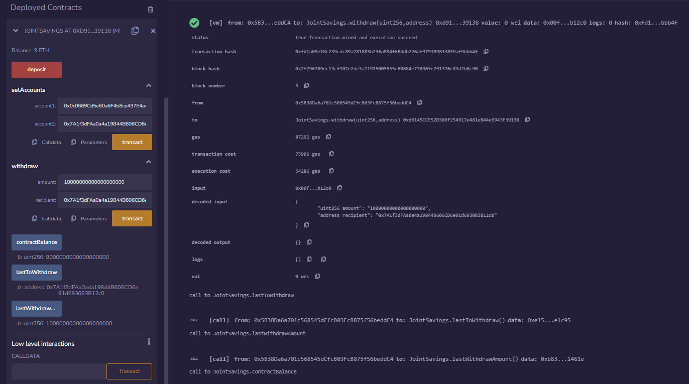

# Module 19 - Solidity

This is the page for the twentieth module of the Fintech Bootcamp course, covering Solidity.

This page is a continuation of my GitHub learning structure for this course.

Above you will see the *^*.sol files for this homework along with Excuted_Results for the README.

## Smart Contract Details

This week, we needed to write a simple smart contract that accepts two user addresses to control a joint savings account.

The deployed contract allowed funds to be sent between the smart contract and the two user addresses.

All the transaction details are shown in the execution results below.

## Contract Execution

* __*1 - Smart Contract Deployment*__
   
  Below shows the deployment of the smart contract with the transaction hash and contract address.

  

 

* __*2 - Contract Deposit*__
   
  I sent 20 ETH to the contract (shown in Wei).

  

 

* __*3 - Balance and User Accounts*__
 
  The Joint Savings contract is shown with 20 ETH balance and the two user addresses ready to transact.

  

 

  Transaction confirmed addition of the two addresses as account1/account2.

  

 

* __*3 - Contract to User Account Transactions*__
 
  Here are 3 transactions requested to the user accounts:
  1 ETH in Wei to account1

  

 
  
  10 ETH in Wei to account2
  

  

 

  5 ETH to account1
  

  

 

## Back to Fintech Home

* [Fintech Bootcamp Home](https://github.com/d4np3/fintech)
